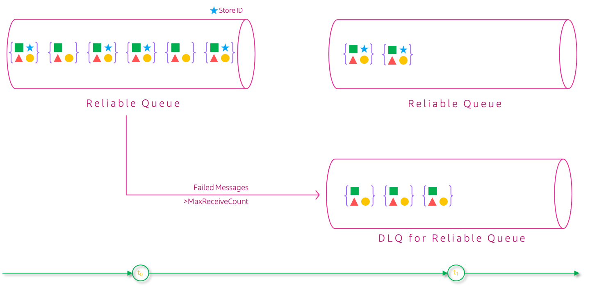
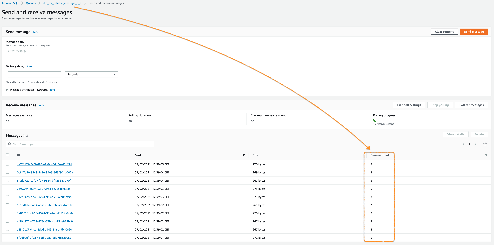
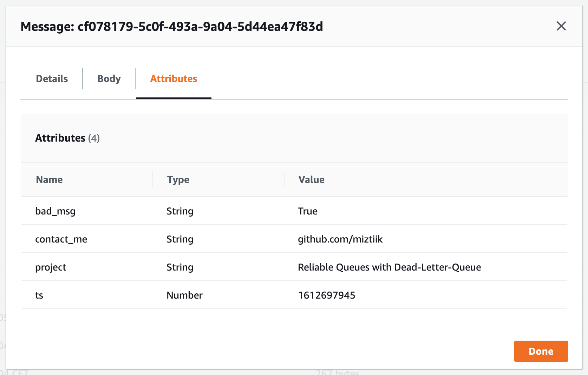

# Reliable Message Processing with Dead-Letter-Queues

Mystique Unicorn App uses message queues to orchestrate their workflows. The messages that are ingested in the queues are produced by stores in multiple geographical locations. For example, if the stores places an order with a particular _product ID_, but the _product ID_ is unavailable, the app fails. Recently the developers made a change to the app, that allowed them to add the `store_id` to all incoming messages. When ever this _attribute_ is missing in the payload, that message should not be processed.

As their solutions architect, Can you help them handle these _bad/poison-pill_ messages?


## 🎯 Solutions

Occasionally messages cannot be processed for a variety of possible issues. In most cases, we do not know the issue. But here we know that when the attribute `store_id` is missing we should not process the message.  When ever we encounter an message without this _field_ then we will need to the move message from the main queue to another special queue: `dead-letter queue(DLQ)`. Currently the queue has messages with and without the attribute.


What we want to achieve is to isolate the messages that do not have `store_id` attribute to a different queue, so that they can be analyzed later. We can achieve this by using _redrive policy_. 

> The redrive policy specifies the _source queue_, the _dead-letter queue_, and the conditions under which Amazon SQS moves messages from the former to the latter if the consumer of the source queue fails to process a message a specified number of times. When the `ReceiveCount` for a message exceeds the `maxReceiveCount` for a queue, Amazon SQS moves the message to a dead-letter queue (with its original message ID). 

> For example, if the source queue has a redrive policy with `maxReceiveCount` set to `5`, and the consumer of the source queue receives a message `6` times without ever deleting it, Amazon SQS moves the message to the dead-letter queue.




 Amazon SQS supports DLQs, But Amazon SQS does not create the dead-letter queue automatically. You must first create the queue before using it as a dead-letter queue. Once you have messages in the DLQ you can do the following,

- Configure an alarm[s] for any messages delivered to a DLQ.
- Analyze the contents of messages delivered to a dead-letter queue  and logs from your consumer application exceptions


The incoming messages from the stores looks something like this.

```json
{
  "msg_body": {
    "name": "Shifter",
    "dob": "1945-10-17",
    "gender": "F",
    "ssn_no": "396144610",
    "data_share_consent": false,
    "evnt_time": "2021-02-06T18:56:59.165483"
  },
  "msg_attr": {
    "project": {
      "DataType": "String",
      "StringValue": "Reliable Queues with Dead-Letter-Queue"
    },
    "contact_me": {
      "DataType": "String",
      "StringValue": "github.com/miztiik"
    },
    "ts": {
      "DataType": "Number",
      "StringValue": "1612637819"
    },
    "store_id": {
      "DataType": "Number",
      "StringValue": "3"
    }
  }
}
```


In this demo, We will build an SQS queue called `reliable_q` and also DLQ that will be `dlq_for_reliable_q`. We will have lambda functions to produce some messages(to act as stores/producers) and ingest them into our `reliable_q`. Another lambda to act as a consumer to process these messages. When our consumer lambda encounters any message without `store_id` attribute, the lambda will throw an exception. The primary queue is configured to process the failed message for `2` times(`maxReceiveCount`). If it still fails, then the messages are _automatically_ moved to the `dlq_for_reliable_q`


The final AWS architecture looks something like,


In this article, we will build an architecture, similar to the one shown above. We will start backwards so that all the dependencies are satisfied.

1.  ## 🧰 Prerequisites

    This demo, instructions, scripts and cloudformation template is designed to be run in `us-east-1`. With few modifications you can try it out in other regions as well(_Not covered here_).

    - 🛠 AWS CLI Installed & Configured - [Get help here](https://youtu.be/TPyyfmQte0U)
    - 🛠 AWS CDK Installed & Configured - [Get help here](https://www.youtube.com/watch?v=MKwxpszw0Rc)
    - 🛠 Python Packages, _Change the below commands to suit your OS, the following is written for amzn linux 2_
      - Python3 - `yum install -y python3`
      - Python Pip - `yum install -y python-pip`
      - Virtualenv - `pip3 install virtualenv`

1.  ## ⚙️ Setting up the environment

    - Get the application code

      ```bash
      git clone https://github.com/miztiik/reliable-sqs-with-dlq
      cd reliable-sqs-with-dlq
      ```

1.  ## 🚀 Prepare the dev environment to run AWS CDK

    We will use `cdk` to make our deployments easier. Lets go ahead and install the necessary components.

    ```bash
    # You should have npm pre-installed
    # If you DO NOT have cdk installed
    npm install -g aws-cdk

    # Make sure you in root directory
    python3 -m venv .venv
    source .venv/bin/activate
    pip3 install -r requirements.txt
    ```

    The very first time you deploy an AWS CDK app into an environment _(account/region)_, you’ll need to install a `bootstrap stack`, Otherwise just go ahead and deploy using `cdk deploy`.

    ```bash
    cdk bootstrap
    cdk ls
    # Follow on screen prompts
    ```

    You should see an output of the available stacks,

    ```bash
    sqs-message-producer-ingestor-stack
    reliable-sqs-with-dlq-stack
    ```

1.  ## 🚀 Deploying the application

    Let us walk through each of the stacks,

    - **Stack: sqs-message-producer-ingestor-stack**

      This stack will create the `reliable_q` and the DQL `dlq_for_reliable_q` SQS Queues. An producer lambda function that runs for about `5` seconds ingesting stream of store messages events for `5` different stores ranging from `store_id=1` to `store_id=5`

      Initiate the deployment with the following command,

      ```bash
      cdk deploy sqs-message-producer-ingestor-stack
      ```

      After successfully deploying the stack, Check the `Outputs` section of the stack. You will find the `ReliableMessageQueue` and the producer lambda function `SqsDataProducer`. We will invoke this function later during our testing phase.

    - **Stack: reliable-sqs-with-dlq-stack**

      This stack will create the lambda function that will have our `reliable_q` as our event source. When ever there is a message in our reliable queue, this function will be invoked.

      Initiate the deployment with the following command,

      ```bash
      cdk deploy reliable-sqs-with-dlq-stack
      ```

      After successfully deploying the stack, Check the `Outputs` section of the stack. You will find the `msgConsumer` lambda function.


1.  ## 🔬 Testing the solution

    1. **Invoke Producer Lambda**:
      Let us start by invoking the lambda from the producer stack `reliable-sqs-with-dlq-producer-stack` using the AWS Console. If you want to ingest more events, use another browser window and invoke the lambda again.
          ```json
          {
            "statusCode": 200,
            "body": "{\"message\": {\"status\": true, \"msg_cnt\": 91, \"bad_msg\": 24}}"
          }
          ```
        Here in this invocation, We have ingested about `14` messages. Within those message, we have `3` messages does not have `store_id` identified as `bad_msg`.

    1. **Check Consumer Cloudwatch Logs**:

       After a couple of minutes, check the consumer cloudwatch logs. Usually the log name should be something like this, `/aws/lambda/reliable_queue_consumer_reliable-sqs-with-dlq-stack`. Navigate to the log stream

       You should be finding a mix of successful processing like this, 
       ```json
        {
            "resp": {
                "status": true,
                "tot_msgs": 1,
                "f_msgs": 0,
                "s_msgs": 1
            }
        }
       ```
       and some `ERROR` message like this. 
      ```py
      [ERROR] Exception: {"missing_store_id":True}
      Traceback (most recent call last):
        File "/var/task/index.py", line 111, in lambda_handler
          m_process_stat = process_msgs(q_url, event["Records"])
        File "/var/task/index.py", line 85, in process_msgs
          raise Exception(err)
      ```

      Once you have confirmed this, check out the SQS Consume. You will find the same number of failed messages moved to the DLQ `dlq_for_reliable_q`.

      

      If you go ahead and poll the queue for messages, you will find the receive count is `>2`. You can also open one of the messages and look into the _attributes_
      
      


1.  ## 📒 Conclusion

    Here we have demonstrated how to use DLQ for your SQS queues and make sure your messages are processed reliably and move failed messages to a different queue for additional processing. You can extend this by adding a another lambda to process the message from DLQ and move them back to _source_ queue for reprocessing or send an SNS notification to the producers about the failed message.

1.  ## 🧹 CleanUp

    If you want to destroy all the resources created by the stack, Execute the below command to delete the stack, or _you can delete the stack from console as well_

    - Resources created during [Deploying The Application](#-deploying-the-application)
    - Delete CloudWatch Lambda LogGroups
    - _Any other custom resources, you have created for this demo_

    ```bash
    # Delete from cdk
    cdk destroy

    # Follow any on-screen prompts

    # Delete the CF Stack, If you used cloudformation to deploy the stack.
    aws cloudformation delete-stack \
      --stack-name "MiztiikAutomationStack" \
      --region "${AWS_REGION}"
    ```

    This is not an exhaustive list, please carry out other necessary steps as maybe applicable to your needs.

## 📌 Who is using this

This repository aims to show how to use DLQs for SQS to new developers, Solution Architects & Ops Engineers in AWS. Based on that knowledge these Udemy [course #1][103], [course #2][102] helps you build complete architecture in AWS.

### 💡 Help/Suggestions or 🐛 Bugs

Thank you for your interest in contributing to our project. Whether it is a bug report, new feature, correction, or additional documentation or solutions, we greatly value feedback and contributions from our community. [Start here](/issues)

### 👋 Buy me a coffee

[](https://ko-fi.com/Q5Q41QDGK) Buy me a [coffee ☕][900].

### 📚 References

1. [Docs: Amazon SQS DLQ][1]
1. [Docs: When to use DLQ][2]


### 🏷️ Metadata


**Level**: 200

[1]: https://docs.aws.amazon.com/AWSSimpleQueueService/latest/SQSDeveloperGuide/sqs-dead-letter-queues.html
[2]: https://docs.aws.amazon.com/AWSSimpleQueueService/latest/SQSDeveloperGuide/sqs-dead-letter-queues.html

[100]: https://www.udemy.com/course/aws-cloud-security/?referralCode=B7F1B6C78B45ADAF77A9
[101]: https://www.udemy.com/course/aws-cloud-security-proactive-way/?referralCode=71DC542AD4481309A441
[102]: https://www.udemy.com/course/aws-cloud-development-kit-from-beginner-to-professional/?referralCode=E15D7FB64E417C547579
[103]: https://www.udemy.com/course/aws-cloudformation-basics?referralCode=93AD3B1530BC871093D6
[899]: https://www.udemy.com/user/n-kumar/
[900]: https://ko-fi.com/miztiik
[901]: https://ko-fi.com/Q5Q41QDGK
